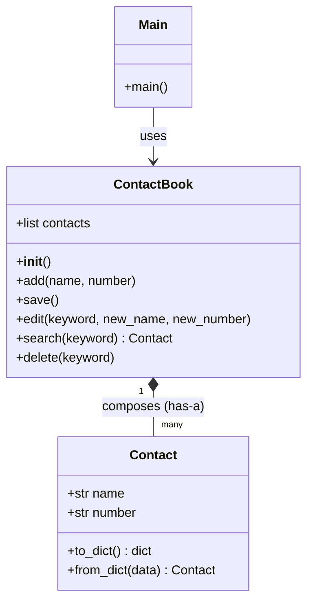

# Contact Mee

A lightweight Command Line Interface (CLI) contact management application written in Python. This project was built to solidify Object-Oriented Programming (OOP) fundamentals, clean code organization, and data persistence before advancing to network programming and AI API integrations.

---

## Overview

**Contact Mee** provides a straightforward terminal interface to manage contact records. It supports full CRUD (Create, Read, Update, Delete) operations and persists contacts locally using a JSON data store. 

Rather than focusing on visual complexity, this project serves as a practical implementation of fundamental software design patterns—specifically focusing on object composition, reference semantics, class methods, and error-handling during file I/O operations.

---

## Features

- **Add Contact**: Create new contacts with a name and phone number.
- **Search Contact**: Query contacts by name or phone number with instant retrieval.
- **Edit Contact**: Modify existing contact details (name, number, or both).
- **Delete Contact**: Remove contacts permanently from the address book.
- **Local Persistence**: Automatically loads data on startup and saves changes to a local JSON file (`contact.json`).

---

## Project Structure

```text
001_Contact_Mee/
├── .gitignore
├── contact.json        # Local JSON data store
├── contact.py          # Contact class representing a single contact
├── contact_book.py     # ContactBook class managing the list of contacts
├── main.py             # App entry point containing the terminal CLI loop
└── journal-...         # Development logs and learning progress
```

- **[contact.py](./contact.py)**: Contains the `Contact` class which models individual contact records and handles serialization/deserialization.
- **[contact_book.py](./contact_book.py)**: Contains the `ContactBook` class which manages the collection of contact objects, file I/O (loading/saving JSON), and CRUD operations.
- **[main.py](./main.py)**: The entry point that runs the interactive CLI interface.

---

## Architecture & Design

The application follows clean separation of concerns: input/output formatting is handled by the presentation layer (`main.py`), collection-level logic is handled by the manager layer (`contact_book.py`), and data entities are modeled by `contact.py`.

The structure utilizes **composition** rather than inheritance:



---

## How to Run

### Prerequisites
- Python 3.10 or higher installed.

### Installation
1. Navigate to the project root directory:
   ```bash
   cd 001_Contact_Mee
   ```

2. (Optional) Set up and activate a Python virtual environment:
   ```bash
   python -m venv .venv
   # Windows:
   .venv\Scripts\activate
   # macOS/Linux:
   source .venv/bin/activate
   ```

3. Ensure a file named `contact.json` exists in the root directory. If it doesn't, create it containing an empty list:
   ```json
   []
   ```

### Running the App
Run the main script to start the interactive terminal session:
```bash
python main.py
```

---

## Engineering Decisions & Tradeoffs

### 1. Composition over Inheritance
A core design decision was structuring the relationship between `ContactBook` and `Contact`. Instead of inheriting from `Contact` (an "is-a" relationship, which would be semantically incorrect), `ContactBook` utilizes **composition** ("has-a" relationship). It maintains a list of `Contact` objects. This separates the logic of a single contact's attributes from the logic of managing, searching, and saving a collection of contacts.

### 2. Local JSON Persistence
For local data storage, a JSON file was preferred over a relational database (like SQLite). 
* **Tradeoff**: While SQLite would prevent loading the entire dataset into memory at once, a simple JSON file provides zero-setup, human-readable local storage. Given the scale of a basic CLI contact manager, JSON loading and dumping performs efficiently and requires no database drivers.

### 3. Pragmatic use of Classmethods (`from_dict`)
The `Contact` class implements a classmethod `from_dict()` for deserialization.
* **Tradeoff**: Creating a dedicated helper like `from_dict(data)` keeps data transformation logic isolated within the class itself. However, since the class is only instantiated from a dictionary in a single place (`__init__` in `ContactBook`), calling the constructor directly with `Contact(data["name"], data["number"])` would have been equally functional and simpler. Recognizing this helped clarify when factory-style classmethods are genuinely necessary (i.e., when multiple call sites exist).

---

## Lessons Learned

### Python Reference Semantics vs. C Memory Model
Coming from a systems-level programming perspective (like C), mapping variable semantics to Python was a key learning milestone:
* **In C**: A variable is a physical memory location containing a value. Assigning `y = x` copies the value into a new memory location.
* **In Python**: A variable is a label/reference pointing to an object in memory. Assigning `y = x` creates another reference pointing to the exact same object.
* **Impact on the codebase**: When `ContactBook.search()` returns a `Contact` object, it returns a reference to the active object in `self.contacts`. Thus, the mutate operations in `ContactBook.edit()` apply directly to the object in memory, and changes are instantly visible within the main contact list without requiring an explicit list-reassignment step.

### Destructive Overwrite Bugs (Initialization Order)
An early bug involved new contacts overwriting all previously stored contacts upon restarting the app. The root cause was that `__init__` did not populate `self.contacts` from the JSON file on startup, meaning the list started empty in memory. Adding a new contact and saving it wrote only the single new contact, overwriting prior database contents. 
* **Fix**: The file-read process was moved inside the `ContactBook` initializer (`__init__`) to populate the memory list before any modification commands are accepted.

---

## Future Improvements

1. **Schema Validation**: Introduce robust validation for inputs (e.g., ensuring phone numbers contain only digits and name strings are not empty).
2. **Graceful File Handling**: Implement a fallback mechanism to automatically generate `contact.json` with an empty array `[]` if the file is missing or corrupted on startup, instead of raising an `FileNotFoundError` or `JSONDecodeError`.
3. **Database Integration**: Migrate from JSON serialization to an SQLite engine to explore database schemas and SQL queries in Python.
