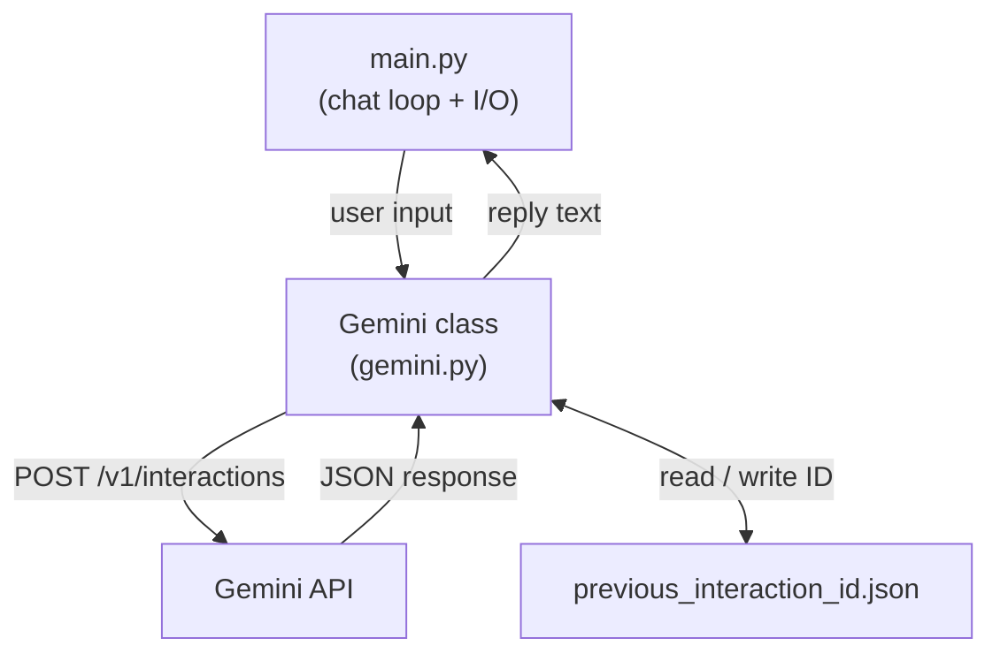

# Simple LLM API Call

A Python CLI project that sends user messages to the Gemini API and maintains a multi-turn conversation, with the session persisted to disk so it survives between runs.

Built as a learning project to get practical experience with HTTP requests, live API JSON parsing, environment variable management, and OOP class design in Python.

---

## Features

- Interactive chat loop in the terminal
- Multi-turn conversation via Gemini's `previous_interaction_id` mechanism
- Persistent session — conversation context survives program restarts (ID saved to a local JSON file)
- API key stored securely in a `.env` file, never hardcoded

---

## Technologies

- **Python 3**
- [`requests`](https://docs.python-requests.org/) — HTTP requests to the Gemini API
- [`python-dotenv`](https://pypi.org/project/python-dotenv/) — loading API key from `.env`
- **Gemini Interactions API** (`/v1/interactions` endpoint)

---

## Project Structure

```
002-simple-llm-api-call/
├── gemini.py                     # Gemini class — wraps the API (auth, request, persistence)
├── main.py                       # Entry point — chat loop and user I/O
├── previous_interaction_id.json  # Auto-generated; stores the last interaction ID
├── .env                          # API key (not committed)
├── .gitignore
└── requirements.txt
```

---

## Architecture

The project is split into two layers:



`main.py` handles the user-facing loop. `gemini.py` handles everything API-related: constructing the request, parsing the response, managing the session ID, and persisting it to disk.

---

## How to Run

**Prerequisites:** Python 3.8+, a Gemini API key.

```bash
# 1. Clone the repo and navigate to this project
cd 002-simple-llm-api-call

# 2. Create and activate a virtual environment
python -m venv .venv
.venv\Scripts\activate        # Windows
# source .venv/bin/activate   # macOS/Linux

# 3. Install dependencies
pip install -r requirements.txt

# 4. Create a .env file with your API key
echo GEMINI_API_KEY=your_key_here > .env

# 5. Run
python main.py
```

---

## Usage

```
> What is the difference between a list and a tuple in Python?
A list is mutable — you can add, remove, or change items after creation...

exit (y/n): n

> Can you give me an example?
Sure. Here's a quick comparison...

exit (y/n): y
bye~!
```

Each message is sent to the Gemini API with `store: true` and the previous interaction ID (if one exists), so Gemini maintains conversation context across turns. When the program exits and is restarted, the last interaction ID is reloaded from `previous_interaction_id.json`, resuming the conversation thread.

---

## Engineering Decisions

**Gemini Interactions API over `generateContent`**
The project uses the `/v1/interactions` endpoint (server-managed multi-turn) rather than the older `generateContent` endpoint. This offloads conversation history to the server — the client only needs to track the most recent `previous_interaction_id` rather than accumulating and resending the full message history on every request. The tradeoff is less client-side control over conversation history, which is acceptable for this scope.

**JSON file for ID persistence**
The `previous_interaction_id` is saved to a `.json` file rather than a plain `.txt` file. The main reason: Python's built-in `json` module makes reading and writing a key-value pair trivial, and JSON is a natural fit for structured data even at this small scale. The file is excluded from version control via `.gitignore`.

**Inline assignment over a dedicated `set_id()` method**
An earlier version had a `set_id()` method that updated `self.previous_interaction_id`. Once `save_previous_id()` was added, calling `set_id()` would have been an extra layer of indirection for a two-line operation. Removing it and writing the assignment directly in `get_chat()` made the flow easier to read without losing anything.

---

## Challenges

**Parsing the right index from the `steps` array**
The Gemini Interactions API response wraps the model's reply in a `steps` array. Index 0 is an internal "thought" step; the actual text is at `steps[1]["content"][0]["text"]`. This wasn't immediately obvious from the structure of the response and required reading the documentation carefully before the correct path was clear.

**SSE response format from `stream: true`**
At one point, `"stream": true` was left active in the request body. This switches the API from returning a single JSON object to returning a Server-Sent Events (SSE) stream — a completely different response format. The code looked correct but parsing failed because the format had silently changed. The fix was removing that one field; the lesson was that request body configuration can change not just what you get, but *how* you get it.

---

## Lessons Learned

- **Read the response format before writing the parser.** Guessing the structure of an API response and fixing it afterward costs more time than reading the docs upfront.
- **Configuration bugs can masquerade as logic bugs.** When something doesn't work and the logic looks right, check request body fields and headers before assuming the code is wrong.
- **Abstractions have a cost.** A method that wraps a single assignment adds a layer of indirection without adding clarity. If reading the code through a method is harder than reading the two lines it hides, the method isn't earning its place.

---

## Future Improvements

- **System instruction** — add a `system` field to the request body to give Gemini a defined role (e.g. content script generator), which is the natural next step toward a more focused application.
- **Streaming responses** — implement SSE handling so replies can be printed token by token as they arrive, instead of waiting for the full response.
- **Error handling** — `response.raise_for_status()` catches HTTP errors, but there's no retry logic, rate limit handling, or user-friendly error messages yet.
- **Session management** — currently there's only one persistent session. A future version could support named sessions or a `--reset` flag to start a fresh conversation.
